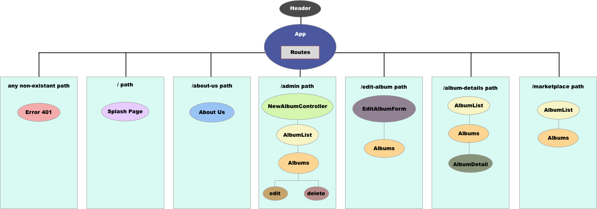

# Jamie Pittak's Music-Store
#### Weeks 16 project for Epicodus

### By Jamie Pittak

## Description
This webpage is a rebuild of the Angular project for an online store that sells albums. The user will be able to add and delete albums from the marketplace. This project is for week 16 "React" of Epicodus.

## Project Layout

## Setup
1. Clone this repository
2. type npm install in your terminal
3. After npm install is finished, type npm run start
4. navigate to http://localhost:8080/

## Known Bugs
1. No ability to delete
2. user cannot click on item for more information

## Specifications
1. User can click on albums to view more information
2. User can create a new album 
3. User can delete album
4. User can edit an album

## Items to be added
1. Add splash page
2. Add about us page
3. Change the Create album page to an admin page with options to add create and delete
4. Add edit album feature
5. Add an Album details page to view information on selected albums
6. Move marketplace to its own path
7. Add delete functionality
8. Style page

## Technologies Used
* Javascript
* JSX
* React
* CSS

## Legal
Copyright (c) 2018 Jamie Laurelann Pittak